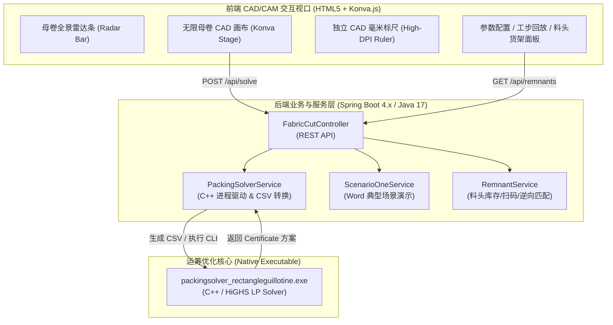

# Cloth Cutting CAD/CAM Simulation & Optimization Platform
# 布料智能排料与数控切割仿真系统 (CutDemoTwo)

[](https://spring.io/projects/spring-boot)
[](https://www.oracle.com/java/)
[](https://konvajs.org/)
[](https://github.com/fontanf/packingsolver)
[](#)

---

## 一、 项目背景与简介

在现代服装制造与纺织数控裁剪（CAM）作业中，**面料成本通常占成衣生产总成本的 60%~70%**。传统人工排料或常规矩形排样软件在面对复杂工业实际工况时存在以下痛点：
1. **疵点规避难**：验布机检测出的飞纱、色差、破洞等瑕疵位置随机，需满足毫米级安全外扩裕量，传统排料易导致残次品或大幅度浪费；
2. **长卷连续开卷排料断层**：面料母卷长达 50m~100m，而数控裁床工作台长度有限（通常为 4m~8m），必须通过多工位步进推进与连续搭切，兼顾跨工位裁片与母卷开卷长度；
3. **数控直刀（Guillotine）工艺限制**：工业切布机通常采用直刀一刀到底（Guillotine Cut）分切工艺，必须保证排料结果具备严格的横/纵正交可切断性与最优刀序；
4. **料头（余料）回收与复用断档**：每卷切裁后产生的大量规整料头（L形余料、端部料头）缺乏系统化建档与订单逆向匹配，沦为工业废弃物。

**CutDemoTwo** 是一套专为服装与纺织工业量身打造的**布料智能排料与数控切割仿真系统**。系统融合了运筹优化算法内核（C++ PackingSolver 2D 断刀剪切引擎）与现代 Web-based 2D CAD/CAM 交互视口，实现了从**母卷全景雷达监控**、**多工位连续开卷搭切**、**疵点避让一刀到底排料**到**料头条码建档与 0 扣料智能复用**的全生命周期闭环管理。

---

## 二、 核心功能与技术亮点

### 1. 工业级母卷全景雷达与连续开卷视口
- **母卷全景雷达条 (Mother Roll Panorama Radar)**：
  - 顶置 0m~60m 迷你母卷全貌视轨，配备 5m/10m 标准工业工程刻度尺；
  - 动态标示全卷验布机瑕疵分布（红色严重疵点 / 橙色轻微疵点 Pin 针点）；
  - 亮青色视口滑块（Viewfinder）实时指示当前裁床台面覆盖区间 `[windowStartY, windowStartY + bedL]`，支持 1:1 跟手拖拽刷动。
- **多工位步进推进与接续搭切 (Station Paging & Overlap Nesting)**：
  - 支持 `[◀ 上一工位 (-5m)]` / `[下一工位 (+5m) ▶]` 一键步进展开；
  - **历史成果保留**：执行当前工位排料时，自动保留其余工位已完成的裁片、切刀工步与料头，动态追加当前工位切割成果；
  - 支持单工位排料清除与全卷清空重排。
- **独立分层 CAD 毫米物理标尺**：
  - 标尺层与画布渲染层解耦（High-DPI 独立 Canvas），彻底杜绝缩放形变与画布漫游漂移；
  - 绝对世界坐标映射，光标动态十字准线毫米级实时追踪。

### 2. 双排料运作模式
| 维度 | 模式一：母卷连续开卷排产 | 模式二：料头复用精益切割 |
| :--- | :--- | :--- |
| **加工对象** | 50m~100m 连续母卷（如 2000mm × 50000mm） | 在库回收料头（如 2000mm × 1600mm） |
| **对齐基准** | 右下角基准（靠右导轨对齐，经向送料） | 左下角 / 规格自适应 |
| **母卷消耗** | 实扣母卷展开长度 $\Delta L$，累计统计出库 | **0 扣料保护**（母卷消耗严格核算为 0.0mm） |
| **料头流转** | 排料后未利用区域切出新料头入库归档 | 消耗旧料头，若有切余则产生子料头递归入库 |

### 3. C++ 真实运筹求解器驱动 (PackingSolver 2D Guillotine)
- 采用树搜索（Tree Search）与分支割平面混合整数规划，针对 2D 矩形剪切（Guillotine Cutting Stock Problem）求解；
- 真实导入多处矩形疵点与安全裕量（Safety Margin），算法在毫秒级时间内计算出 100% 绕开瑕疵的最优排样；
- 严格输出一刀到底的直刀（横切/纵切）切序指令单（Cut Steps），支持步进动态刀痕回放；
- **100% 严密面积守恒**：
  $$\text{总展开面积} = \text{成品裁片面积} + \text{在库回收料头面积} + \text{不可利用工艺废料}$$

### 4. 料头全生命周期管理与智能匹配推荐
- **母卷-料头关联**：料头自动与母卷批号（Roll ID）绑定，继承面料批次与门幅特性；
- **条码追溯**：生成唯一料头资产编号（如 `REM-202609-001`），记录长宽、货架库位与带疵状态；
- **逆向智能推荐**：录入订单成品规格后，算法逆向扫描在库料头，优先推荐门幅匹配、余料最小且满足零母卷消耗的适格料头。

---

## 三、 系统架构与模块划分



### 项目工程目录结构

```
CutDemoTwo/
├── pom.xml                                      # Maven 项目配置文件 (Java 17, Spring Boot 4.1.1)
├── README.md                                    # 项目主说明文档 (中文)
├── GEMINI.md                                    # 决策参谋与实质审查规范
├── spec/                                        # 历史设计规范与变更文档归档目录
│   ├── 2026-09-21_布料切割与Spring工程落地.md
│   ├── 2026-09-21_料口管理与料头切割实现.md
│   ├── 2026-09-21_母卷料头双模式与右下角基准重构.md
│   ├── 2026-09-21_雷达滑块刷动与大红框裁切工位贯穿滚动.md
│   ├── 2026-09-21_界面布局可拖动折叠与雷达平滑跟随优化.md
│   ├── 2026-09-21_全面移除Emoji与工业CAD界面规范化.md
│   ├── 2026-09-21_浅色高亮CAD主题深度优化.md
│   ├── 2026-09-21_修复雷达拖拽失焦与视口跳变隐患.md
│   ├── 2026-09-21_全局Git自动提交规则与版本归档.md
│   └── 2026-09-21_简短描述.md
└── src/
    ├── main/
    │   ├── java/com/example/cutdemotwo/
    │   │   ├── CutDemoTwoApplication.java      # Spring Boot 启动类
    │   │   ├── controller/
    │   │   │   └── FabricCutController.java    # REST API 控制器 (排料、场景、料头接口)
    │   │   ├── model/                          # 领域数据模型 (DTO & Entity)
    │   │   │   ├── CutStep.java                # 切刀工步实体 (横切/纵切/刀序/行程)
    │   │   │   ├── Defect.java                 # 瑕疵实体 (坐标/尺寸/安全边距)
    │   │   │   ├── MotherRollInfo.java         # 母卷台账信息
    │   │   │   ├── PieceDemand.java            # 订单成品规格与需求量
    │   │   │   ├── PlacedPiece.java            # 已排裁片空间分布
    │   │   │   ├── RemnantPiece.java           # 回收料头空间几何
    │   │   │   ├── RemnantStock.java           # 料头库存台账
    │   │   │   ├── SolveRequest.java           # 排料计算请求参数
    │   │   │   └── SolveResponse.java          # 排料计算响应结果
    │   │   └── service/
    │   │       ├── PackingSolverService.java   # C++ PackingSolver 求解器进程调度与结果解析
    │   │       ├── RemnantService.java         # 料头建档、扫码、出入库与逆向智能推荐
    │   │       └── ScenarioOneService.java     # 客户 Word 场景一规则引擎
    │   └── resources/
    │       ├── application.properties          # 服务端口与求解器可执行文件路径配置
    │       └── static/
    │           ├── index.html                  # 工业 CAD/CAM 前端主视口与交互系统
    │           └── konva.min.js                # Konva 2D Canvas 核心图形库
    └── test/
        └── java/com/example/cutdemotwo/
            ├── CutDemoTwoApplicationTests.java # 上下文加载测试
            └── FabricCutBusinessTests.java     # 工业业务集成与面积守恒全面测试 (7项断言)
```

---

## 四、 核心接口定义 (RESTful API)

所有接口均支持跨域访问，数据交互统一采用 JSON 格式。

### 1. 智能排料求解 `POST /api/solve`
- **功能**：接收母卷/料头尺寸、订单裁片需求清单及瑕疵坐标列表，调用求解引擎生成排样方案。
- **请求体 (`SolveRequest`)**：
  ```json
  {
    "feedPortType": "roll",
    "rollId": "ROLL-2026-0920",
    "rollW": 2000.0,
    "rollL": 5000.0,
    "cutOrigin": "right-bottom",
    "demands": [
      { "id": 1, "name": "西装前身-大片", "w": 800, "l": 1200, "count": 2, "allowRotation": false },
      { "id": 2, "name": "上衣大袖-外片", "w": 600, "l": 1000, "count": 4, "allowRotation": false }
    ],
    "defects": [
      { "id": 1, "x": 500, "y": 1400, "w": 150, "h": 150, "margin": 30 }
    ]
  }
  ```
- **响应体 (`SolveResponse`)**：
  包含已排裁片列表 `pieces`、一刀到底切刀工步 `cuts`、切出新料头 `remnants`、面积统计 `totalArea`/`pieceArea`/`remArea`/`wasteArea` 以及是否严格面积守恒。

### 2. 料头资产与库存流转接口
| 接口方法 | 路径 | 功能说明 |
| :--- | :--- | :--- |
| `GET` | `/api/rolls` | 获取系统全部母卷台账及各母卷下在库料头数量统计 |
| `GET` | `/api/remnants?rollId=xxx` | 按母卷筛选在库料头列表（支持查看尺寸、带疵状态、仓位） |
| `POST` | `/api/remnants/scan` | 模拟工业扫码枪扫入料头条码（如 `{"id": "REM-202609-001"}`），快速调取信息 |
| `POST` | `/api/remnants/match` | 传入订单目标裁片长宽，智能推荐本卷中面积最小且满足切割的在库料头 |
| `POST` | `/api/remnants/register` | 新料头登记入库与状态变更 |
| `GET` | `/api/health` | 服务健康检查，返回 C++ 求解器是否就绪与库存概况 |

---

## 五、 环境要求与快速启动

### 1. 运行环境依赖
- **操作系统**：Windows 10 / 11 / Server，Linux，macOS
- **JDK**：Java Development Kit 17 或以上
- **Maven**：3.8+（工程内置 `mvnw` / `mvnw.cmd` 包装器）
- **C++ 求解器（可选）**：
  若需开启真实 C++ 求解，需在 `src/main/resources/application.properties` 中指定已编译好的可执行文件路径：
  ```properties
  packingsolver.executable.path=d:/GitLab/packingsolver/build/src/rectangleguillotine/packingsolver_rectangleguillotine.exe
  ```
  *(注：若未配置 C++ 求解器路径，系统将自动降级运行内置 Word 预设场景一与演练算例，Web 界面与仿真功能完全可用)*

### 2. 编译与单元测试
在项目根目录下执行 Maven 自动化构建与测试：
```bash
# Windows PowerShell / CMD
.\mvnw.cmd test

# Linux / macOS
./mvnw test
```
**测试套件覆盖**：
- `FabricCutBusinessTests.testWordTableOneLShapeDecomposition`：L形余料正交拆解 100% 面积严格守恒测试；
- `FabricCutBusinessTests.testWidthAdaptation`：门幅改宽纵切许可与越界安全拦截测试；
- `FabricCutBusinessTests.testShortRemnantReuse`：短料料头优先复用（母卷 0 扣料）测试；
- `FabricCutBusinessTests.testPackingSolverRealExecutionWithDefects`：真实 C++ 求解器全瑕疵避让与断刀切序生成测试；
- `FabricCutBusinessTests.testRemnantServiceScanAndMatching`：条码精准识别与逆向规格匹配测试；
- `FabricCutBusinessTests.testRemnantFeedPortZeroRollDeduction`：料头料口严格 0 消耗测试；
- `FabricCutBusinessTests.testMotherRollAssociationAndAutoRemnantCreation`：开卷下料新料头自动建档与母卷树状归档测试。

### 3. 启动服务与访问系统
执行以下命令启动 Spring Boot 应用：
```bash
.\mvnw.cmd spring-boot:run
```
服务启动完成后，控制台将提示监听默认端口 `8080`：
- **工业 CAD/CAM 交互主视口**：在现代浏览器（Chrome、Edge、Firefox）中打开：
  👉 **`http://localhost:8080/`**
- **健康监控检查**：
  👉 **`http://localhost:8080/api/health`**

---

## 六、 规范文档与历史演进

项目所有重大功能迭代、界面 CAD 规范化演进、几何坐标基准重构及缺陷修复细节均完整归档在 [`spec/`](./spec/) 目录下，供追溯查阅：

| 文档名称 | 核心决策与实施内容 |
| :--- | :--- |
| [`2026-09-21_布料切割与Spring工程落地.md`](./spec/2026-09-21_布料切割与Spring工程落地.md) | 工程自桌面迁移固化至 Spring Boot，集成 Konva 视口与 C++ 求解器桥接 |
| [`2026-09-21_料口管理与料头切割实现.md`](./spec/2026-09-21_料口管理与料头切割实现.md) | 引入料头料口（Feed Port）、条码检索与母卷 0 消耗保护机制 |
| [`2026-09-21_母卷料头双模式与右下角基准重构.md`](./spec/2026-09-21_母卷料头双模式与右下角基准重构.md) | 重构右下角基准对齐（靠右导轨）、母卷与料头双模式自由切换 |
| [`2026-09-21_雷达滑块刷动与大红框裁切工位贯穿滚动.md`](./spec/2026-09-21_雷达滑块刷动与大红框裁切工位贯穿滚动.md) | 推出 0~60m 母卷全景雷达条、大红框工位贯穿推拉与无级漫游 |
| [`2026-09-21_界面布局可拖动折叠与雷达平滑跟随优化.md`](./spec/2026-09-21_界面布局可拖动折叠与雷达平滑跟随优化.md) | 左右分栏拖动调节宽度、卡片抽屉折叠、雷达 1:1 防抖跟手拖拽 |
| [`2026-09-21_全面移除Emoji与工业CAD界面规范化.md`](./spec/2026-09-21_全面移除Emoji与工业CAD界面规范化.md) | 全面清理浮夸风 Emoji，采用 AutoCAD/SolidWorks 工业设计语言与规范图标 |
| [`2026-09-21_浅色高亮CAD主题深度优化.md`](./spec/2026-09-21_浅色高亮CAD主题深度优化.md) | 优化浅色高对比度工程主题，提升高分辨率裁床车间工控机显示辨识度 |
| [`2026-09-21_修复雷达拖拽失焦与视口跳变隐患.md`](./spec/2026-09-21_修复雷达拖拽失焦与视口跳变隐患.md) | 修复全局 `pointerup` 事件监听，消除跨 DOM 拖拽失焦与视口跳变 Bug |
| [`2026-09-21_全局Git自动提交规则与版本归档.md`](./spec/2026-09-21_全局Git自动提交规则与版本归档.md) | 固化单次改动自动规范提交规则与版本追溯机制 |
